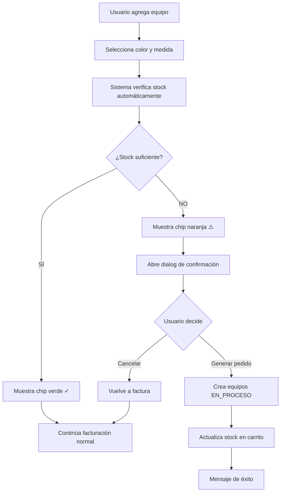

# 🎨 Nueva Funcionalidad: Selección de Color y Medida en Facturación Manual

## 📋 Resumen

Se ha implementado una mejora completa en el módulo de **Facturación Manual** que permite:

1. ✅ Seleccionar **Color** y **Medida** específicos al agregar equipos
2. ✅ **Verificación automática de stock** con los criterios seleccionados
3. ✅ **Dialog de confirmación** cuando no hay stock suficiente
4. ✅ **Generación automática de pedido de fabricación** si el usuario acepta

---

## 🚀 Cómo Funciona

### 1. Agregar Equipo al Carrito

Al agregar un equipo a la factura manual:

```
1. Selecciona "Tipo" = EQUIPO
2. Selecciona el equipo (receta) que deseas
3. ⭐ NUEVO: Selecciona Color y Medida del equipo
4. Ingresa cantidad deseada
```

### 2. Verificación Automática de Stock

El sistema verifica automáticamente el stock disponible cuando:
- Cambias el equipo (receta)
- Cambias el color
- Cambias la medida
- Cambias la cantidad

**Indicadores visuales:**
- ✅ **Chip Verde "✓ Stock OK"**: Hay suficiente stock disponible
- ⚠️ **Chip Naranja "Stock: X"**: Stock insuficiente (muestra unidades disponibles)

### 3. Dialog de Confirmación

Si no hay suficiente stock, se muestra un dialog con:

```
┌─────────────────────────────────────────┐
│ ⚠️ Stock Insuficiente                   │
├─────────────────────────────────────────┤
│ No hay suficiente stock disponible      │
│                                         │
│ Detalle del Equipo:                     │
│ • Equipo: Vitrina Exhibidora 350L       │
│ • Color: BLANCO_LISO                    │
│ • Medida: 1.5m                          │
│ • Cantidad solicitada: 5                │
│ • Stock disponible: 2                   │
│ • Faltante: 3                           │
│                                         │
│ ¿Deseas generar un pedido de           │
│ fabricación para crear los 3 equipos    │
│ faltantes?                              │
│                                         │
│ [Cancelar]  [Sí, Generar Pedido]       │
└─────────────────────────────────────────┘
```

### 4. Opciones del Usuario

#### Opción A: Cancelar
- El item permanece en el carrito
- Puedes cambiar color/medida/cantidad para buscar stock disponible
- O puedes eliminar el item del carrito

#### Opción B: Generar Pedido de Fabricación
- El sistema crea automáticamente los equipos faltantes
- Estado: **EN_PROCESO**
- Con el color y medida especificados
- Se registran en **Producción → Equipos Fabricados**

---

## 💡 Casos de Uso

### Caso 1: Stock Completo Disponible
```
Cliente solicita: 3 heladeras BLANCO_LISO de 1.5m
Stock disponible: 5 heladeras BLANCO_LISO de 1.5m

Resultado:
✅ Chip verde "✓ Stock OK"
✅ Puedes facturar inmediatamente
```

### Caso 2: Stock Parcial
```
Cliente solicita: 5 heladeras NEGRO_LISO de 2.0m
Stock disponible: 2 heladeras NEGRO_LISO de 2.0m

Resultado:
⚠️ Chip naranja "Stock: 2"
⚠️ Dialog: "Faltan 3 equipos"
💡 Opción: Generar pedido de fabricación para las 3 faltantes
```

### Caso 3: Sin Stock
```
Cliente solicita: 4 heladeras DAKAR de 1.8m
Stock disponible: 0 heladeras DAKAR de 1.8m

Resultado:
⚠️ Chip naranja "Stock: 0"
⚠️ Dialog: "Faltan 4 equipos"
💡 Opción: Generar pedido de fabricación para las 4
```

---

## 🎯 Selectores Disponibles

### Colores de Equipos
```typescript
BLANCO_LISO, PLATA, MARRON, BEIGE, DORADO, PLATEADO,
BRONCE, COBRE, INOXIDABLE, MADERA, ACERO, ATAKAMA,
FAPLAC_NORDICO, GRIS_GRAFITO, DAKAR, HELSINKI,
LINO_TIERRA, MADERA_CEREJEIRA, ROBLE_KENDAL_ENCERADO,
NEGRO_LISO, NEGRO_VETA, NOGAL_LINCOLN, PREMIUM,
ROBLE_DAKAR, ROBLE_KAISEBERG, TEKA_ARTICO, TEKA_OSLO,
FAPLAC_TRIBAL, FAPLAC_NORDICO_FINLANDES
```

### Medidas de Equipos
```typescript
0.8m, 0.9m, 1.0m, 1.1m, 1.2m, 1.3m, 1.4m, 1.5m,
1.6m, 1.7m, 1.8m, 1.9m, 2.0m, 2.2m, 2.4m, 2.5m,
2.8m, 3.0m, 30x40x50m, 25x32x6cm, 60x40cm, 70x45cm
```

---

## 🔧 Detalles Técnicos

### Verificación de Stock

La verificación se realiza contra `equipos_fabricados`:
```sql
SELECT * FROM equipos_fabricados
WHERE receta_id = ?
  AND (color = ? OR ? IS NULL)
  AND (medida = ? OR ? IS NULL)
  AND estado_asignacion = 'DISPONIBLE'
```

### Creación de Pedido de Fabricación

Cuando el usuario acepta generar el pedido:
```typescript
POST /api/equipos-fabricados/batch
{
  recetaId: number,
  cantidad: number,
  color: ColorEquipo,
  medida: MedidaEquipo,
  estado: 'EN_PROCESO',
  tipo: string,
  modelo: string
}
```

---

## 📊 Flujo Completo



---

## ⚠️ Mensajes de Error Posibles

### Error 409: Stock Insuficiente de Componentes
```
⚠️ Stock Insuficiente de Componentes

No se pueden fabricar los equipos solicitados porque 
faltan componentes en el inventario.

💡 Debes:
1. Revisar el inventario de componentes necesarios
2. Realizar compras de los componentes faltantes
3. Luego crear el pedido de fabricación manualmente 
   desde Producción → Equipos Fabricados
```

**Causa**: La receta del equipo requiere componentes que no están en stock.

**Solución**: 
1. Ir a **Inventario → Componentes**
2. Verificar qué componentes faltan
3. Generar orden de compra
4. Esperar recepción de componentes
5. Volver a intentar crear el pedido de fabricación

---

## 🎓 Tips y Mejores Prácticas

### ✅ Recomendaciones

1. **Siempre especifica color y medida** para equipos
   - Mejora la trazabilidad
   - Evita confusiones en fabricación
   - Facilita la asignación de equipos reales

2. **Revisa el chip de stock** antes de finalizar la factura
   - Verde = Puedes facturar inmediatamente
   - Naranja = Requiere pedido de fabricación

3. **Usa "Sin especificar" solo en casos excepcionales**
   - Dificulta la búsqueda de stock específico
   - Puede generar asignaciones incorrectas

4. **Si generas pedido de fabricación:**
   - Verifica en Producción → Equipos Fabricados
   - Asegúrate de tener componentes en stock
   - Coordina con el equipo de producción

### ❌ Evita

1. No cambiar color/medida después de generar pedido de fabricación
2. No facturar sin revisar el estado del stock
3. No generar múltiples pedidos de fabricación para el mismo item

---

## ⚡ Mejora de UX - Verificación No Intrusiva

**IMPORTANTE**: El dialog de confirmación solo aparece al hacer click en "Crear Factura", **NO** cuando cambias color, medida o cantidad en el carrito.

- ✅ Puedes editar libremente todos los campos
- ✅ Los chips de stock se actualizan automáticamente como indicadores visuales
- ✅ El dialog solo interrumpe cuando realmente vas a crear la factura
- ✅ Si aceptas generar el pedido, la facturación continúa automáticamente

## 🔄 Integración con Otros Módulos

### Módulo de Producción
- Los equipos EN_PROCESO aparecen en **Equipos Fabricados**
- Se pueden completar manualmente cuando se fabriquen
- Cambio de estado: EN_PROCESO → DISPONIBLE → RESERVADO → FACTURADO → ENTREGADO

### Módulo de Inventario
- Verifica componentes necesarios para fabricación
- Genera alertas si faltan componentes
- Permite hacer pedidos de compra

### Módulo de Ventas
- Los equipos DISPONIBLES se pueden asignar a facturas
- Los equipos FACTURADOS aparecen en entregas
- Trazabilidad completa desde venta hasta entrega

---

## 📈 Mejoras Futuras (Propuestas)

### Corto Plazo
- [ ] Mostrar tiempo estimado de fabricación
- [ ] Notificar cuando equipos EN_PROCESO estén listos
- [ ] Filtro de búsqueda por color/medida en inventario

### Mediano Plazo
- [ ] Sugerencias de colores/medidas según stock
- [ ] Reserva automática de equipos al agregar al carrito
- [ ] Historial de pedidos de fabricación por cliente

### Largo Plazo
- [ ] Predicción de demanda por color/medida
- [ ] Optimización de stock según ventas históricas
- [ ] Integración con planificación de producción

---

## 📞 Soporte

Si tienes problemas o dudas:
1. Revisa este documento
2. Verifica logs en consola del navegador (F12)
3. Consulta con el equipo técnico

## ✅ Checklist de Testing

- [x] Agregar equipo con color y medida
- [x] Verificación automática de stock
- [x] Dialog de confirmación aparece correctamente
- [x] Generación de pedido de fabricación funciona
- [x] Indicadores visuales (chips) se actualizan
- [x] Mensajes de error son claros
- [x] Integración con backend funcionando
- [x] Compatible con flujo de facturación existente

---

**Fecha de implementación**: 20 de Noviembre, 2025
**Versión**: 1.0.0
**Desarrollador**: Sistema Ripser Frontend Team
